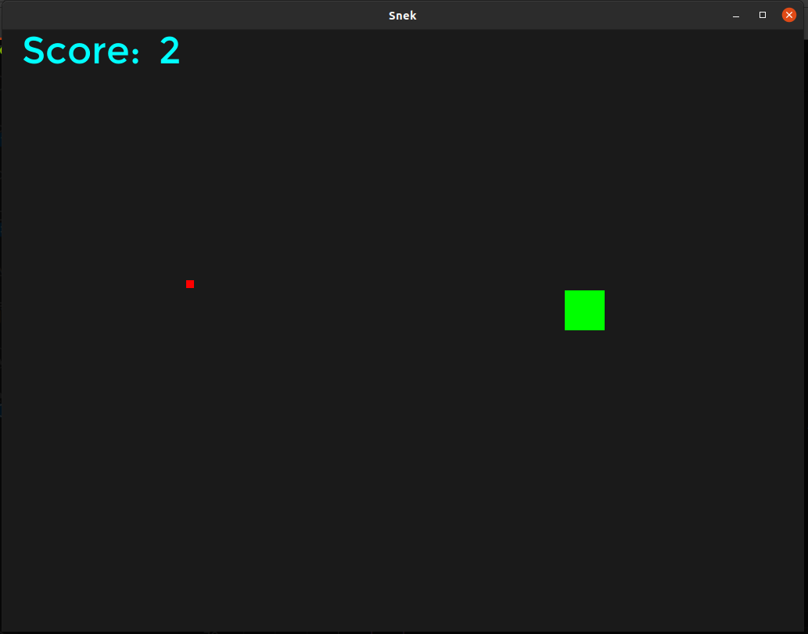

# C_snek
Snake written in pure C using only:
- GLFW + GLEW - Opengl setup
- freetype for font loading




# Build Instructions
- Ubuntu (24.04)

```
sudo apt install build-essential
sudo apt install libglew-dev
sudo apt install libglfw3
sudo apt install libglfw3-dev
sudo apt install libfreetype6-dev
sudo apt install libcglm-dev
git clone https://github.com/tylerwight/C_snek

cd C_snek
make
```

- Windows
//TODO
