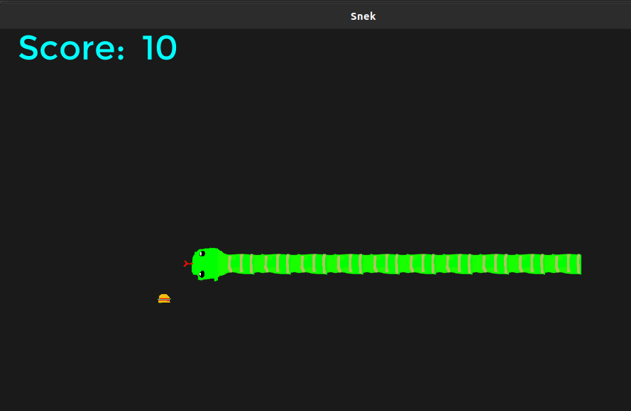

# C_snek
Snake written in pure C using only:
- GLFW + GLEW - Opengl setup
- freetype for font loading





# Build Instructions
- Ubuntu (24.04)

```
sudo apt install build-essential
sudo apt install git
sudo apt install libglew-dev
sudo apt install libglfw3
sudo apt install libglfw3-dev
sudo apt install libfreetype6-dev
sudo apt install libcglm-dev
sudo apt install libopenal-dev 
sudo apt install libalut-dev

git clone https://github.com/tylerwight/C_snek
cd C_snek
mkdir bin
make
```

- Windows
install MSYS2
```
pacman -S mingw-w64-ucrt-x86_64-gcc
pacman -S mingw-w64-ucrt-x86_64-glew
pacman -S mingw-w64-ucrt-x86_64-glfw
pacman -S mingw-w64-ucrt-x86_64-cglm
pacman -S mingw-w64-ucrt-x86_64-freetype
pacman -S mingw-w64-ucrt-x86_64-zlib
pacman -S mingw-w64-ucrt-x86_64-harfbuzz
pacman -S mingw-w64-ucrt-x86_64-bzip2
pacman -S mingw-w64-ucrt-x86_64-graphite2
pacman -S git

git clone https://github.com/tylerwight/C_snek

cd C_snek
make
```